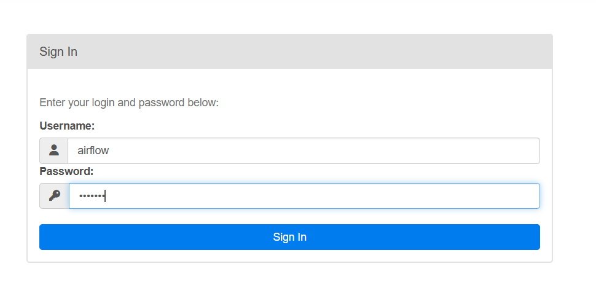
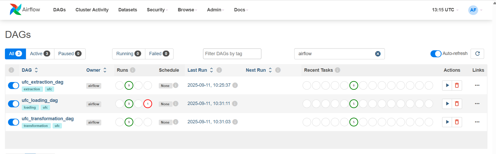

# ufc-data-pipeline
This project is an end-to-end ETL pipeline for UFC event and fight data. It scrapes data from UFCStats, transforms and cleans it, and loads it into a PostgreSQL data warehouse using Airflow for orchestration.

## Table of Contents
<!-- To be filled as the README develops -->

## Getting Started

To set up the project locally, follow these steps:

1. **Create a project folder**  
   You can name it `UFC` or any name you prefer.

2. **Set up a Python environment**  
   For local testing and running scripts, Python is required.  
   Create a virtual environment (e.g., `ufc_env`):

   ```
   python -m venv ufc_env
   ```

3. **Prepare Docker files**  
   Ensure you have `docker-compose.yaml` and `requirements.txt` in your project folder.

4. **Start Airflow and services**  
   Run the following command to start the necessary services:

   ```
   docker compose up -d
   ```

   This will start the Apache Airflow server.  
   Once running, open your browser and go to `http://localhost:8080` to access the Airflow UI.

   ### Airflow Interface
   

   ### Airflow DAGs
   

   The interface will show three DAGs:
   - `ufc_extraction_dag`
   - `ufc_transformation_dag`
   - `ufc_loading_dag`

   The extraction and transformation DAGs require no further steps.

5. **Configure database connection for loading DAG**  
   For the loading DAG, you need to connect Airflow to your database:
   - In Airflow UI, go to **Admin > Connections** and configure your database connection.

   ### Airflow Database Connection
   

6. **Create the database schema**  
   Use DBeaver or another database tool to create your PostgreSQL database and tables with the following SQL:

   ## Schema Creation

   ```sql
   -- 1. Date Dimension
   CREATE TABLE dim_date (
       date_value DATE PRIMARY KEY,
       year INT,
       month INT,
       day INT,
       day_of_week INT
   );

   -- 2. Geography Dimension
   CREATE TABLE geo_dim (
       geo_id SERIAL PRIMARY KEY,
       city VARCHAR(100),
       state_or_region VARCHAR(100),
       country VARCHAR(100),
       CONSTRAINT unique_geo UNIQUE (city, state_or_region, country)
   );

   -- 3. Event Fact Table
   CREATE TABLE events (
       event_id SERIAL PRIMARY KEY,
       event_name VARCHAR(255),
       event_date DATE REFERENCES dim_date(date_value),
       event_url VARCHAR(255),
       geo_id INT REFERENCES geo_dim(geo_id),
       CONSTRAINT unique_event UNIQUE (event_name, event_date)
   );

   -- 4. Fighter Dimension
   CREATE TABLE fighters (
       fighter_id SERIAL PRIMARY KEY,
       fighter_name VARCHAR(255),
       fighter_url VARCHAR(255) UNIQUE,
       height_cm INT,
       weight_kg INT,
       reach_cm INT,
       stance VARCHAR(50),
       dob DATE REFERENCES dim_date(date_value),
       age INT,
       wins INT,
       losses INT,
       draws INT,
       nc INT,
       total_fights INT,
       reach_to_height_ratio FLOAT,
       record VARCHAR(50),
       significant_strikes_landed_per_minute FLOAT,
       significant_strike_accuracy FLOAT,
       significant_strikes_absorbed_per_minute FLOAT,
       takedown_average_per_15_min FLOAT,
       takedown_accuracy FLOAT,
       takedown_defense FLOAT,
       submission_average_per_15_min FLOAT,
       CONSTRAINT unique_fighter_identity UNIQUE (fighter_name, dob)
   );

   -- 5. Fight Fact Table
   CREATE TABLE fights (
       fight_id SERIAL PRIMARY KEY,
       fight_url VARCHAR(255) UNIQUE,
       event_id INT REFERENCES events(event_id),
       fighter1_id INT REFERENCES fighters(fighter_id),
       fighter2_id INT REFERENCES fighters(fighter_id),
       weight_class VARCHAR(100),
       method VARCHAR(100),
       method_type VARCHAR(100),
       round INT,
       time VARCHAR(20),
       time_seconds INT,
       total_fight_time_seconds INT,
       winner_id INT REFERENCES fighters(fighter_id)
   );

   -- 6. Fight Details Fact Table
   CREATE TABLE fight_details (
       fight_details_id SERIAL PRIMARY KEY,
       fighter_id INT REFERENCES fighters(fighter_id),
       fight_id INT REFERENCES fights(fight_id),
       referee VARCHAR(100),
       significant_strikes_landed INT,
       significant_strikes_attempted INT,
       significant_strike_accuracy FLOAT,
       head_strikes_landed INT,
       head_strikes_attempted INT,
       body_strikes_landed INT,
       body_strikes_attempted INT,
       leg_strikes_landed INT,
       leg_strikes_attempted INT,
       distance_strikes_landed INT,
       distance_strikes_attempted INT,
       clinch_strikes_landed INT,
       clinch_strikes_attempted INT,
       ground_strikes_landed INT,
       ground_strikes_attempted INT,
       total_strikes_landed INT,
       total_strikes_attempted INT,
       takedowns_landed INT,
       takedowns_attempted INT,
       takedown_accuracy FLOAT,
       knockdowns INT,
       submission_attempts INT,
       reversals INT,
       control_time_seconds INT,
       significant_strike_accuracy_opponent FLOAT
   );
   ```

   ---

   ## Populating the Date Dimension (1950–2030)

   You can use the following PostgreSQL block to fill the `dim_date` table with every day from 1950-01-01 to 2030-12-31:

   ```sql
   INSERT INTO dim_date (date_value, year, month, day, day_of_week)
   SELECT
       d::DATE AS date_value,
       EXTRACT(YEAR FROM d)::INT AS year,
       EXTRACT(MONTH FROM d)::INT AS month,
       EXTRACT(DAY FROM d)::INT AS day,
       EXTRACT(DOW FROM d)::INT AS day_of_week
   FROM generate_series('1950-01-01'::DATE, '2030-12-31'::DATE, INTERVAL '1 day') AS d;
   ```

   You can verify your tables with:

   ```sql
   SELECT * FROM geo_dim ;
   SELECT * FROM events ;
   SELECT * FROM fighters ;
   SELECT * FROM fights ;
   SELECT * FROM fight_details ;
   SELECT * FROM dim_date ;
   ```

7. **Database schema diagram**  
   
