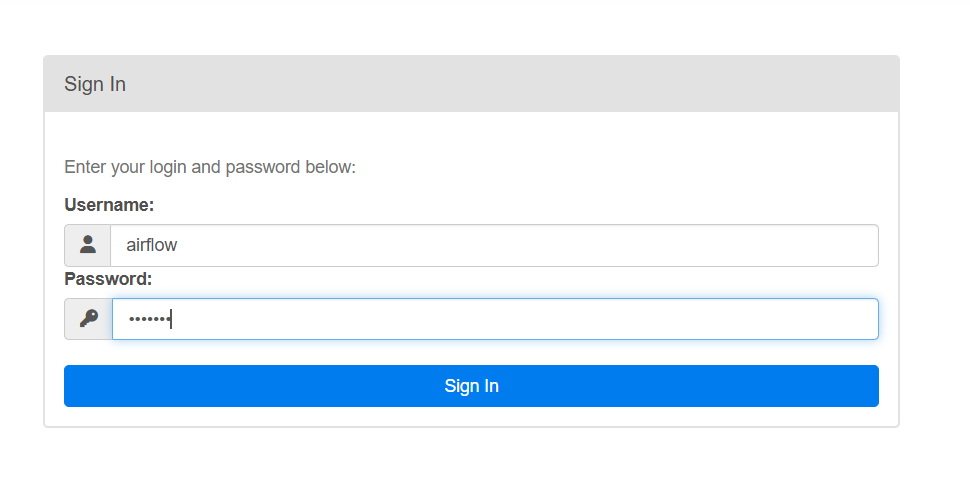
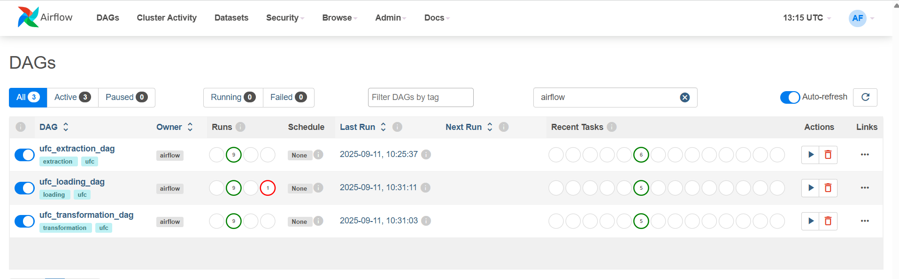
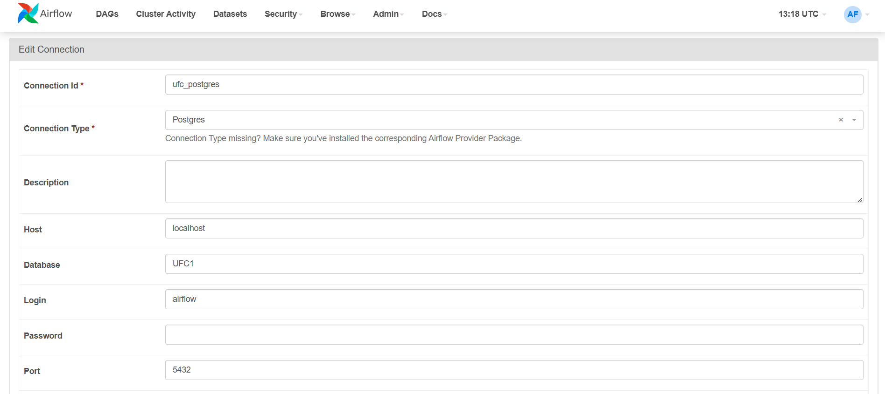
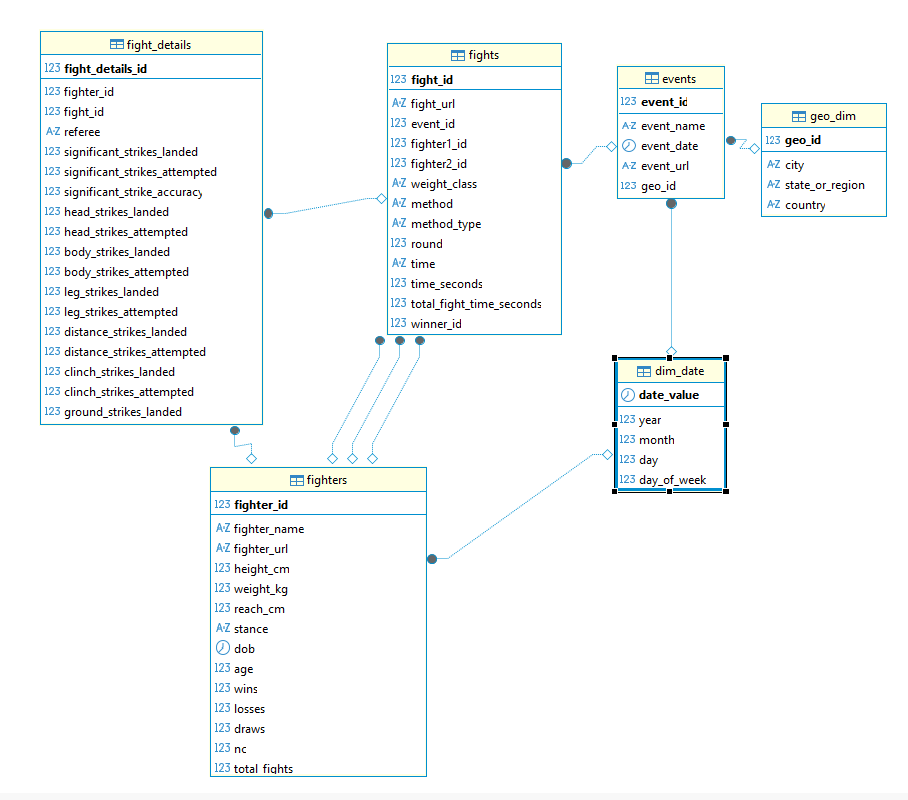
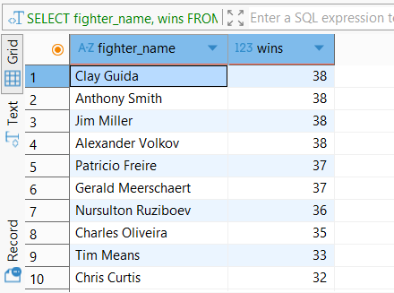
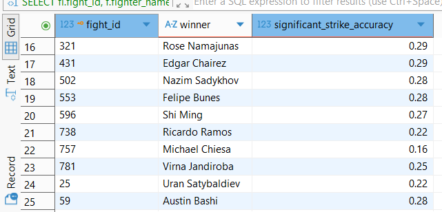
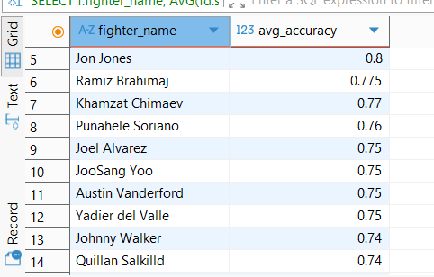
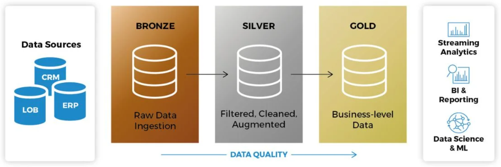

# ufc-data-pipeline

Every week, new UFC events and fights take place, generating a wealth of data on athletes, results, and performance metrics. Tracking and analyzing this information manually is time-consuming and error-prone. This project provides an automated solution: it scrapes fresh UFC data on a regular schedule, processes and cleans it, and loads it into a structured data warehouse. By leveraging Airflow for orchestration, you can easily schedule the pipeline to run after each event, ensuring your database is always up-to-date for analytics, reporting, and insights into fighters and fight outcomes. Whether you're a data analyst, sports enthusiast, or developer, this pipeline makes UFC data accessible and actionable.

**Source:** [UFCStats Events](http://ufcstats.com/statistics/events/completed)

## Table of Contents

- [Getting Started](#getting-started)
- [Data Warehouse Schema Analysis](#data-warehouse-schema-analysis)
- [Usage Examples](#usage-examples)
- [Project Structure](#project-structure)

## Getting Started

Before using Airflow, you can manually test scripts in the `src_windows` folder.  
The output files will be saved in the `Data` folder.  
This is useful for quick local testing, but not part of the main pipeline.

To set up the project locally, follow these steps:

1. **Create a project folder**  
   You can name it `UFC` or any name you prefer.

2. **Set up a Python environment**  
   For local testing and running scripts, Python is required.  
   Create a virtual environment (e.g., `ufc_env`):

   ```
   python -m venv ufc_env
   ```

3. **Install Apache Airflow (optional for manual runs)**  
   To install Airflow locally, run:
   ```
   pip install apache-airflow
   ```

4. **Prepare Docker files**  
   Ensure you have `docker-compose.yaml` and `requirements.txt` in your project folder.

5. **Start Airflow and services**  
    After starting Docker Desktop  
    Run the following command to start the necessary services:

   ```
   docker compose up -d
   ```

   This will start the Apache Airflow server.  
   Once running, open your browser and go to `http://localhost:8080` to access the Airflow UI.

   ### Airflow Interface
   

   ### Airflow DAGs
   

   The interface will show three DAGs:
   - `ufc_extraction_dag`
   - `ufc_transformation_dag`
   - `ufc_loading_dag`

   The extraction and transformation DAGs require no further steps.

6. **Configure database connection for loading DAG**  
   For the loading DAG, you need to connect Airflow to your database:
   - In Airflow UI, go to **Admin > Connections** and configure your database connection.

   ### Airflow Database Connection
   

7. **Create the database schema**  
   Use DBeaver or another database tool to create your PostgreSQL database and tables with the following SQL:

   ## Schema Creation

   ```sql
   -- 1. Date Dimension
   CREATE TABLE dim_date (
       date_value DATE PRIMARY KEY,
       year INT,
       month INT,
       day INT,
       day_of_week INT
   );

   -- 2. Geography Dimension
   CREATE TABLE geo_dim (
       geo_id SERIAL PRIMARY KEY,
       city VARCHAR(100),
       state_or_region VARCHAR(100),
       country VARCHAR(100),
       CONSTRAINT unique_geo UNIQUE (city, state_or_region, country)
   );

   -- 3. Event Fact Table
   CREATE TABLE events (
       event_id SERIAL PRIMARY KEY,
       event_name VARCHAR(255),
       event_date DATE REFERENCES dim_date(date_value),
       event_url VARCHAR(255),
       geo_id INT REFERENCES geo_dim(geo_id),
       CONSTRAINT unique_event UNIQUE (event_name, event_date)
   );

   -- 4. Fighter Dimension
   CREATE TABLE fighters (
       fighter_id SERIAL PRIMARY KEY,
       fighter_name VARCHAR(255),
       fighter_url VARCHAR(255) UNIQUE,
       height_cm INT,
       weight_kg INT,
       reach_cm INT,
       stance VARCHAR(50),
       dob DATE REFERENCES dim_date(date_value),
       age INT,
       wins INT,
       losses INT,
       draws INT,
       nc INT,
       total_fights INT,
       reach_to_height_ratio FLOAT,
       record VARCHAR(50),
       significant_strikes_landed_per_minute FLOAT,
       significant_strike_accuracy FLOAT,
       significant_strikes_absorbed_per_minute FLOAT,
       takedown_average_per_15_min FLOAT,
       takedown_accuracy FLOAT,
       takedown_defense FLOAT,
       submission_average_per_15_min FLOAT,
       CONSTRAINT unique_fighter_identity UNIQUE (fighter_name, dob)
   );

   -- 5. Fight Fact Table
   CREATE TABLE fights (
       fight_id SERIAL PRIMARY KEY,
       fight_url VARCHAR(255) UNIQUE,
       event_id INT REFERENCES events(event_id),
       fighter1_id INT REFERENCES fighters(fighter_id),
       fighter2_id INT REFERENCES fighters(fighter_id),
       weight_class VARCHAR(100),
       method VARCHAR(100),
       method_type VARCHAR(100),
       round INT,
       time VARCHAR(20),
       time_seconds INT,
       total_fight_time_seconds INT,
       winner_id INT REFERENCES fighters(fighter_id)
   );

   -- 6. Fight Details Fact Table
   CREATE TABLE fight_details (
       fight_details_id SERIAL PRIMARY KEY,
       fighter_id INT REFERENCES fighters(fighter_id),
       fight_id INT REFERENCES fights(fight_id),
       referee VARCHAR(100),
       significant_strikes_landed INT,
       significant_strikes_attempted INT,
       significant_strike_accuracy FLOAT,
       head_strikes_landed INT,
       head_strikes_attempted INT,
       body_strikes_landed INT,
       body_strikes_attempted INT,
       leg_strikes_landed INT,
       leg_strikes_attempted INT,
       distance_strikes_landed INT,
       distance_strikes_attempted INT,
       clinch_strikes_landed INT,
       clinch_strikes_attempted INT,
       ground_strikes_landed INT,
       ground_strikes_attempted INT,
       total_strikes_landed INT,
       total_strikes_attempted INT,
       takedowns_landed INT,
       takedowns_attempted INT,
       takedown_accuracy FLOAT,
       knockdowns INT,
       submission_attempts INT,
       reversals INT,
       control_time_seconds INT,
       significant_strike_accuracy_opponent FLOAT
   );
   ```

   ---

   ## Populating the Date Dimension (1950–2030)

   You can use the following PostgreSQL block to fill the `dim_date` table with every day from 1950-01-01 to 2030-12-31:

   ```sql
   INSERT INTO dim_date (date_value, year, month, day, day_of_week)
   SELECT
       d::DATE AS date_value,
       EXTRACT(YEAR FROM d)::INT AS year,
       EXTRACT(MONTH FROM d)::INT AS month,
       EXTRACT(DAY FROM d)::INT AS day,
       EXTRACT(DOW FROM d)::INT AS day_of_week
   FROM generate_series('1950-01-01'::DATE, '2030-12-31'::DATE, INTERVAL '1 day') AS d;
   ```

   You can verify your tables with:

   ```sql
   SELECT * FROM geo_dim ;
   SELECT * FROM events ;
   SELECT * FROM fighters ;
   SELECT * FROM fights ;
   SELECT * FROM fight_details ;
   SELECT * FROM dim_date ;
   ```

8. **Database schema diagram**  
   

## Data Warehouse Schema Analysis

This data warehouse uses a **star schema** model, with several fact tables linked to dimension tables:

- **Fact tables:**
  - `fight_details`: Numeric details of each fight (strikes, attempts, etc.).
  - `fights`: Information about the fight itself (result, round, duration, winner, etc.).

- **Dimension tables:**
  - `fighters`: Descriptive information about fighters.
  - `events`: Metadata about the event (name, date, location).
  - `geo_dim`: Location details.
  - `dim_date`: Time dimension (year, month, day, etc.).

👉 This model is based on a star schema, but can also be described as a **constellation (galaxy) schema**, since multiple fact tables (`fights` and `fight_details`) share the same dimensions (`fighters`, `dim_date`, `events`).

**Type:** Relational data warehouse in star schema / constellation schema  
**Usage:** Analytical, ideal for OLAP queries (fight statistics, fighter performance, time-based analysis, etc.).

## Usage Examples

The following queries and visualizations are based on the 50 UFC events before September 13, 2025.

### Top 10 Fighters by Wins

```sql
SELECT fighter_name, wins
FROM fighters
ORDER BY wins DESC
LIMIT 10;
```


---

### Fights Where Winner's Significant Strike Accuracy < 30%

```sql
SELECT fi.fight_id, f.fighter_name AS winner, fd.significant_strike_accuracy
FROM fights fi
JOIN fighters f ON fi.winner_id = f.fighter_id
JOIN fight_details fd ON fi.fight_id = fd.fight_id AND fd.fighter_id = fi.winner_id
WHERE fd.significant_strike_accuracy < 0.3;
```



---

### Fighters Ranked by Average Significant Strike Accuracy

```sql
SELECT f.fighter_name, AVG(fd.significant_strike_accuracy) AS avg_accuracy
FROM fight_details fd
JOIN fighters f ON fd.fighter_id = f.fighter_id
GROUP BY f.fighter_name
ORDER BY avg_accuracy DESC;
```


---

## Project Structure

```
UFC/
│
├── dags/
│   ├── extraction_dag.py
│   ├── transformation_dag.py
│   ├── load_dag.py
│   └── __pycache__/
│
├── data_airflow/
│   ├── raw/
│   │   ├── all_event_fights.csv
│   │   ├── fight_significant_strikes_totals.csv
│   │   ├── fight_totals_.csv
│   │   ├── fighters.csv
│   │   └── ufc_events.csv
│   └── processed/
│       ├── all_event_fights_transformed.csv
│       ├── fight_details.csv
│       ├── fighters_cleaned.csv
│       └── ufc_events_transformed.csv
│
├── src_airflow/
│   ├── extraction/
│   │   ├── extract_event_data.py
│   │   ├── extract_event_fights.py
│   │   ├── extract_fighters_details.py
│   │   ├── strikes.py
│   │   └── totals.py
│   ├── transformation/
│   │   ├── transform_events.py
│   │   ├── transform_fight_details.py
│   │   ├── transform_fighters.py
│   │   └── transform_fights.py
│   └── Loading/
│       ├── load_fighters.py
│       ├── load_fights_details.py
│       ├── load_fights.py
│       ├── load_geo_dim.py
│       ├── load_ufc_event.py
│       └── type_code.py
│
├── docker-compose.yaml
├── requirements.txt
├── README.md
```

- **dags/**: Contains Airflow DAG definitions for extraction, transformation, and loading.
- **data_airflow/**: Stores raw and processed CSV files generated by the pipeline.
- **src_airflow/**: Source code for extraction, transformation, and loading scripts used by the DAGs.
- **docker-compose.yaml**: Docker configuration for running Airflow, PostgreSQL, and Redis.
- **requirements.txt**: Python dependencies for local development and pipeline execution.
- **README.md**: Project documentation and setup instructions.

## Kimball Approach: Why Dimensional Modeling is Ideal for UFC Fight Data

Choosing the Kimball methodology for this project is a deliberate decision, tailored to the analytical nature of UFC fight data. Here’s why the Kimball approach is the best fit:

1. **Nature of the Data: Analytical, Not Transactional**  
   UFC data revolves around events, facts, and dimensions (fights, fighters, dates, locations, etc.), which aligns perfectly with Kimball’s dimensional modeling. The primary goal is to analyze trends, performance, and statistics—not to track transactional updates or operational workflows.

2. **Star Schema = User-Friendly Analytics**  
   Kimball’s star and constellation schemas are designed for easy querying and reporting. Analysts, data scientists, and BI tools can quickly slice and dice data (e.g., "Average strikes per round by fighter across all events in 2023") without complex joins or deep technical skills.

3. **OLAP and Aggregation Needs**  
   UFC data is often aggregated: totals per event, win/loss streaks, fighter stats over time, etc. Kimball models optimize for these aggregations with denormalized tables (facts and dimensions), whereas Inmon’s normalized approach is less efficient for these use cases.

4. **Speed and Performance**  
   Star schemas reduce join complexity and enable faster queries for analytics—critical when exploring large, detailed fight datasets. BI/reporting tools integrate seamlessly with dimensional models, further speeding up analysis.

5. **Flexibility for Evolving Sports Data**  
   New stats or dimensions (e.g., new fight metrics, locations, rules) can be added easily by extending fact or dimension tables. Kimball’s approach supports incremental growth without major redesigns.

6. **Self-Service and Accessibility**  
   Business users and analysts can intuitively explore the warehouse, as opposed to Inmon’s normalized model, which is more technical and complex. Kimball’s approach empowers stakeholders to generate insights without needing data engineering help for every question.

## Medallion Architecture: From Raw to Gold Data

This project follows a **medallion architecture** to structure and manage data quality through multiple stages:

- **Bronze (Raw):**  
  The raw data extracted from UFCStats is stored in the `data_airflow/raw` folder. This layer contains unprocessed, original data as scraped from the source.

- **Silver (Processed):**  
  After transformation, cleaned and structured data is saved in the `data_airflow/processed` folder. This silver layer is ready for further analysis and ensures consistency and quality.

- **Gold (Ready for Analytics):**  
  Once the processed data is loaded into the PostgreSQL data warehouse, it becomes the gold layer—optimized and ready for visualization, reporting, and advanced analytics.



